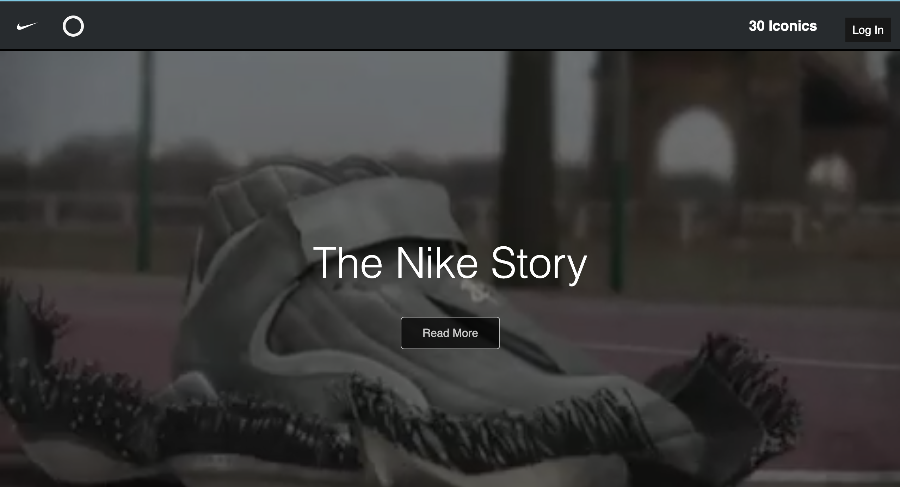
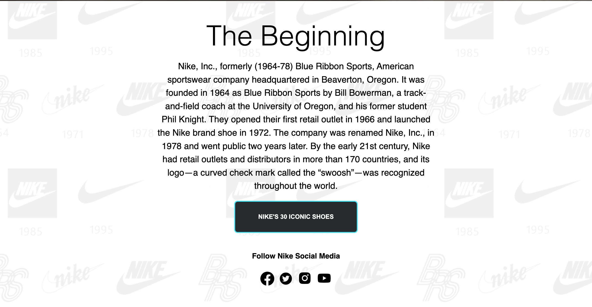
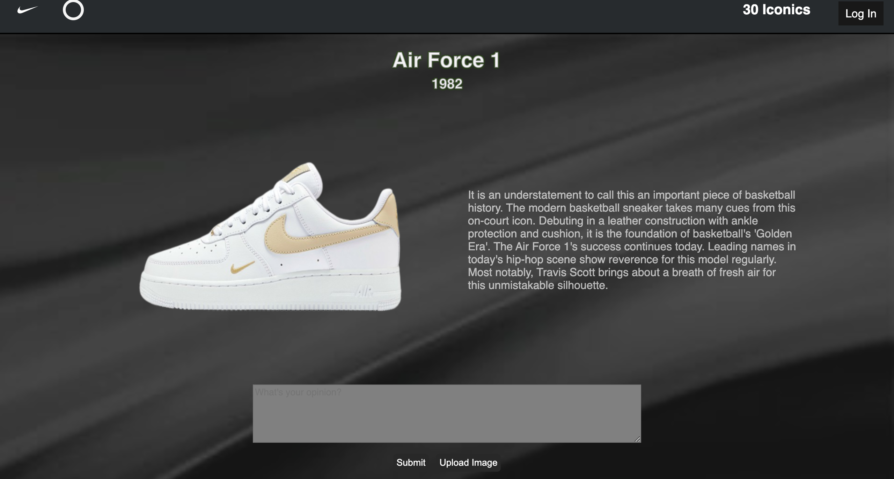
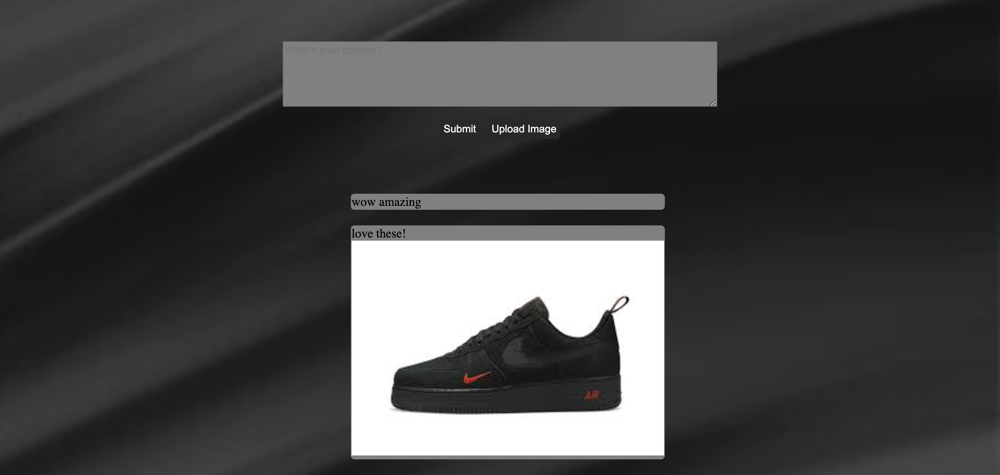

# TheNikeStory
The Nike Story is a website for Sneakerheads, people who loves shoes and anyone who is curious about the Nike Brand. It is a website that recognizes Nike's 30 iconic shoes throughout the beginning of the brand till now.

## Deployment

To deploy this project run

```bash
 cd server
```
```bash
 yarn install server
```
```bash
 yarn start server
```
```bash
 cd client
```
```bash
 yarn install client
```
```bash
 yarn start client
```
## Features

- Login
- Search Bar
- Comment, post, edit and delete
- Upload photos

## This is the Login page


## Once you have logged in you will be directed to the landing page




## After clicking the button for Nike's 30 Iconic Shoes you will be directed to this page which you can view all the shoes


## Clicking a Shoe will take you to it's details page



## You can comment and upload a picture below

